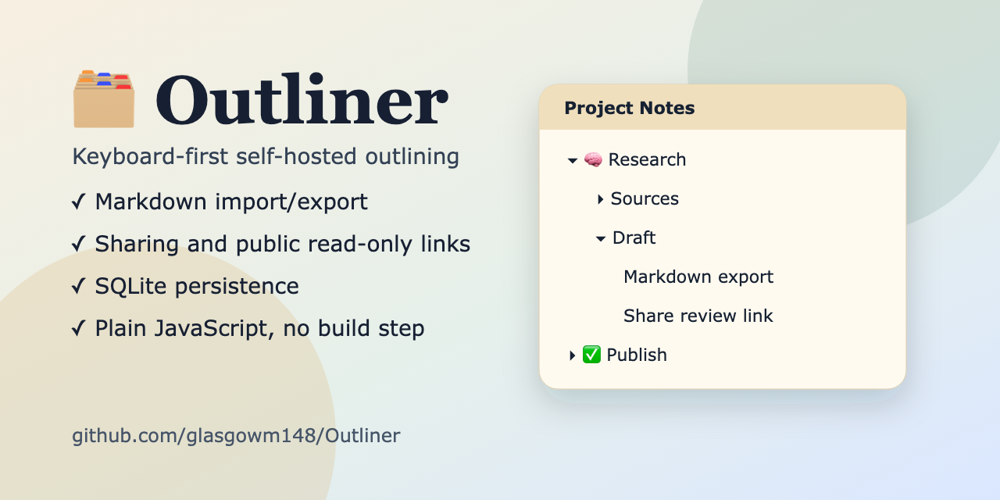

<h1 align="center">
  <br>
  🗂️
  <br>
  Outliner
</h1>

<p align="center">
  <strong>A keyboard-first outliner with sharing, public links, Markdown import/export, and SQLite persistence.</strong>
</p>

<p align="center">
  
  <a href="LICENSE"></a>
</p>

<p align="center">
  <a href="#quick-start">Quick Start</a>
  ·
  <a href="#features">Features</a>
  ·
  <a href="#why-outliner">Why Outliner?</a>
  ·
  <a href="#import-and-export">Import / Export</a>
  ·
  <a href="#collaboration">Collaboration</a>
  ·
  <a href="#hosting">Hosting</a>
</p>

Outliner is a small self-hosted outliner built with plain browser JavaScript and a Node + SQLite backend.

It focuses on fast keyboard editing, portable Markdown/JSON exports, simple list sharing, and local SQLite persistence.

<p align="center">
  
</p>

## At A Glance

| What | Details |
| --- | --- |
| App shape | Self-hosted Node app with SQLite |
| Frontend | Plain browser JavaScript, HTML, and CSS |
| Data model | Multiple nested lists per account |
| Sharing | Registered collaborators plus read-only public links |
| Portability | Markdown subtree export and full JSON backups |
| Best fit | Personal notes, shared outlines, and private deployments |

## Features

- Nested rows with indent, outdent, collapse, expand, branch move, colour, and multi-select
- Fast keyboard editing with multiline row text
- Inline markdown rendering for headings, emphasis, quotes, links, lists, tables, bare URLs, and images
- Multiple lists per account
- Email/password authentication with isolated per-user data
- Shared lists with `viewer` and `editor` collaborator roles
- Read-only public links that do not require login
- Current-list and all-list search
- Undo/redo for local row changes
- Owner-only history, named checkpoints, restore previews, and revision restore
- Markdown row export through a preview modal with copy/download actions
- JSON backup import/export for the full database snapshot
- SQLite persistence with an immediate per-user bootstrap cache in `localStorage`

## Why Outliner?

- **Self-hosted storage:** data lives in a SQLite file you can back up, inspect, and move.
- **Keyboard-first editing:** rows are designed for fast outlining, indentation, movement, and collapse/expand flows.
- **Markdown-friendly:** import/export preserves portable outline structure instead of locking notes into a proprietary format.
- **Simple sharing:** collaborate with registered users or publish a read-only public link.
- **Plain web stack:** no frontend framework, build pipeline, or generated client bundle.

## Quick Start

Requirements:

- Node.js `24.3+`
- npm

Install dependencies:

```bash
npm install
```

Run the app:

```bash
npm start
```

Open:

[http://127.0.0.1:4310](http://127.0.0.1:4310)

On first run, create an account on the auth screen.

Development server:

```bash
npm run dev
```

Useful scripts:

| Command | Purpose |
| --- | --- |
| `npm start` | Run the app with `node server.js` |
| `npm run dev` | Run with Node watch mode |
| `npm run check:syntax` | Syntax-check the server and browser modules |
| `npm run check:hygiene` | Check tracked files for conflict markers and trailing whitespace |
| `npm run check` | Run syntax checks, tests, production dependency audit, and hygiene checks |
| `npm run clean` | Remove generated local test artifacts |
| `npm test` | Run smoke, unit, and browser tests |
| `npm run test:smoke` | Run API/server smoke tests |
| `npm run test:unit` | Run unit tests |
| `npm run test:e2e` | Run only Playwright browser tests |
| `npm audit --omit=dev` | Check production dependency advisories |

## Testing

Run the full suite:

```bash
npm test
```

This runs:

- smoke/API coverage in [tests/smoke.test.mjs](tests/smoke.test.mjs)
- unit tests in [tests/unit](tests/unit)
- browser tests in [tests/e2e/app.spec.js](tests/e2e/app.spec.js)

If Playwright browsers are not installed yet:

```bash
npx playwright install
```

## How The App Stores Data

Outliner uses a local-first UI model, backed by server persistence:

- The browser paints immediately from a scoped `localStorage` bootstrap cache.
- The authenticated SQLite snapshot then hydrates the app.
- Edits are sent as row/list operations through `/api/db/ops`.
- Saves are serialized in the client so older writes cannot overtake newer writes.
- Same-row edit conflicts return `409 ROW_CONFLICT` and open a resolution modal.
- Shared lists are one server-side list viewed by every collaborator.

This is collaborative, but not real-time multiplayer. There are no live cursors, presence indicators, or CRDT merging.

### Data Safety

- SQLite data is stored in `data/outliner.sqlite` by default.
- Browser bootstrap caches are only startup accelerators; SQLite is the source of truth after hydration.
- Use Settings -> Export backup before risky imports, repairs, or manual database work.
- If you expose the app beyond localhost, put it behind HTTPS and set `OUTLINER_SECURE_COOKIES=1`.

## Import And Export

Outliner supports two structural paste/import formats:

1. Plain-text tab-indented outlines
2. Normal markdown list outlines

The importer is structural:

- tab-indented plain text uses indentation only
- markdown outlines use list markers plus indentation
- plain prose is kept as row text
- emojis, headings, bold text, and words are not used to guess hierarchy

If a paste does not preserve explicit structure, Outliner will not invent a tree from it.

Examples:

```text
Project
	Planning
		Scope
		Questions
	Build
```

```markdown
- Project
  - Planning
    - Scope
    - Questions
  - Build
```

### Markdown Export

Row export opens a modal instead of downloading immediately. From there you can:

- preview the generated markdown
- copy it to the clipboard
- download it as a `.md` file

### Full Backup Export

Settings supports full JSON backup/export for the complete database snapshot, plus import of that same format.

JSON backups are intended for Outliner restore/migration. Markdown export is intended for portable reading and re-importing row structure.

## Collaboration

List owners can:

- share a list with a registered user by email
- choose `Viewer` or `Editor` access
- change a collaborator role later
- remove collaborators
- create or revoke a read-only public link
- create named checkpoints
- restore earlier revisions

Editors can:

- edit shared rows
- rename the shared list
- leave the shared list

Viewers can:

- read shared rows
- search and navigate the list
- expand/collapse branches locally
- leave the shared list

Public links are always read-only.

## Security Notes

The server includes baseline hardening for self-hosted deployments:

- `HttpOnly`, `SameSite=Lax` session cookies
- same-origin checks on mutating API requests
- JSON content-type checks for JSON bodies
- a trusted client header on mutating API requests
- conservative request size limits
- basic auth rate limiting
- security headers and a restrictive content security policy
- public list responses omit owner email addresses

Before running on a public host:

- Use HTTPS and set `OUTLINER_SECURE_COOKIES=1`.
- Set `OUTLINER_ALLOW_REGISTRATION=0` after creating intended accounts if open registration is not wanted.
- Back up `data/outliner.sqlite` regularly.
- Put the Node process behind a reverse proxy that enforces request/body limits.
- Treat email/password auth as basic app auth, not enterprise identity management.

## Hosting

Outliner runs as a Node app with persistent SQLite storage.

Good fits:

- a VPS or home server running Node behind Caddy, Nginx, or another HTTPS reverse proxy
- small app platforms that support persistent disks, such as Fly.io, Render, Railway, Hetzner, or DigitalOcean
- a private LAN server if you only need local access

Important requirements:

- persistent storage for `data/outliner.sqlite`
- HTTPS for any public internet deployment
- `OUTLINER_SECURE_COOKIES=1` when served over HTTPS
- regular SQLite backups
- a process manager or platform restart policy

## Keyboard Shortcuts

| Action | Shortcut |
| --- | --- |
| Edit selected row | `ee` or double-click |
| Add row below current subtree | `Enter` |
| New line inside row | `Shift + Enter` |
| Indent / outdent | `Tab` / `Shift + Tab` |
| Move branch | `Alt + Up` / `Alt + Down` |
| Collapse / expand | `Left` / `Right` |
| Undo | `Cmd/Ctrl + Z` |
| Redo | `Cmd/Ctrl + Shift + Z` or `Cmd/Ctrl + Y` |
| Select all visible rows | `Cmd/Ctrl + A` |
| Apply colour | `1` to `6` |
| Clear colour | `0` |

## Settings

The account menu provides:

- keyboard shortcut reference
- colour key reference
- database stats
- JSON backup export/import
- structure repair for the current snapshot
- sign out

List options provide:

- history and checkpoints
- share/collaboration controls
- public-link controls
- delete or leave list

## Storage And API

SQLite lives at:

```text
data/outliner.sqlite
```

Main routes:

| Method | Route | Purpose |
| --- | --- | --- |
| `GET` | `/api/auth/session` | Read auth session |
| `POST` | `/api/auth/register` | Create account |
| `POST` | `/api/auth/login` | Sign in |
| `POST` | `/api/auth/logout` | Sign out |
| `GET` | `/api/db` | Load current user snapshot |
| `PUT` | `/api/db` | Save a full snapshot |
| `POST` | `/api/db/ops` | Save operation-based row/list changes |
| `GET` | `/api/stats` | Read database stats |
| `POST` | `/api/lists/:id/share` | Share a list with a user |
| `PATCH` | `/api/lists/:id/share` | Update collaborator role |
| `DELETE` | `/api/lists/:id/share` | Remove a collaborator |
| `POST` | `/api/lists/:id/leave` | Leave a shared list |
| `POST` | `/api/lists/:id/public-link` | Enable public link |
| `DELETE` | `/api/lists/:id/public-link` | Disable public link |
| `GET` | `/api/lists/:id/revisions` | List history revisions |
| `POST` | `/api/lists/:id/revisions` | Create checkpoint |
| `POST` | `/api/lists/:id/revisions/:revisionId/restore` | Restore revision |
| `GET` | `/api/public/:token` | Read public list |

Mutating API routes are intended for the bundled browser client. They require same-origin requests and the `X-Outliner-Request: 1` header.

## Authentication

The auth model is deliberately simple:

- email + password
- `HttpOnly` session cookie
- per-user list ownership
- shared access through `list_shares`

There is no email verification, password reset, OAuth, admin UI, or hosted account recovery flow.

## Configuration

Optional environment variables:

| Variable | Default | Description |
| --- | --- | --- |
| `HOST` | `127.0.0.1` | Server host |
| `PORT` | `4310` | Server port |
| `OUTLINER_DATA_DIR` | `./data` | Directory for the SQLite file |
| `OUTLINER_DB_PATH` | `./data/outliner.sqlite` | Full SQLite path |
| `OUTLINER_SECURE_COOKIES` | unset | Set to `1` behind HTTPS so session cookies are `Secure` |
| `OUTLINER_ALLOW_REGISTRATION` | `1` | Set to `0` to disable new account registration |

Example:

```bash
PORT=5000 OUTLINER_DB_PATH=/tmp/outliner.sqlite npm start
```

Local/private deployment example:

```bash
HOST=0.0.0.0 PORT=4310 OUTLINER_SECURE_COOKIES=1 OUTLINER_ALLOW_REGISTRATION=0 npm start
```

## Project Structure

```text
.
├── .editorconfig             # Shared editor formatting defaults
├── .env.example              # Optional environment variable template
├── .github/
│   ├── dependabot.yml        # Dependency update checks
│   └── workflows/ci.yml      # CI for tests, audit, and whitespace checks
├── CONTRIBUTING.md           # Contribution and PR guidance
├── LICENSE                   # MIT license
├── server.js                 # Thin ESM entry wrapper
├── public/
│   ├── app.js                # Client app logic
│   ├── index.html            # App shell
│   ├── markdown.js           # Markdown rendering and export helpers
│   ├── outline.js            # Structural paste/import parsing
│   ├── storage.js            # Client storage, backup, and diff helpers
│   └── styles.css            # UI styling
├── src/
│   └── server.cjs            # Node server and SQLite API
├── SECURITY.md               # Vulnerability reporting and deployment baseline
├── tests/e2e/app.spec.js     # Browser coverage
├── tests/hygiene.mjs         # Repository hygiene checks
├── tests/smoke.test.mjs      # API and server smoke coverage
├── tests/unit/markdown.test.mjs
├── tests/unit/outline.test.mjs
├── tests/unit/storage.test.mjs
└── data/                     # Local SQLite data, ignored by git
```

## Current Limits

- Collaboration is not live real-time editing.
- Conflict handling is row-based, not CRDT/OT.
- Public links are read-only.
- The app expects to run through the Node server; opening `public/index.html` directly bypasses auth and SQLite.
- `node:sqlite` is still experimental in Node.

## Troubleshooting

- If the page loads but data does not persist, check that the server is running and that `data/` is writable.
- If Playwright tests fail on a fresh machine, run `npx playwright install`.
- If public links load over HTTPS but login does not persist, check `OUTLINER_SECURE_COOKIES` and reverse-proxy headers.
- If markdown import nests incorrectly, verify the source actually preserves list markers or tab indentation; the importer deliberately ignores semantic cues like emojis, bold text, and headings.
